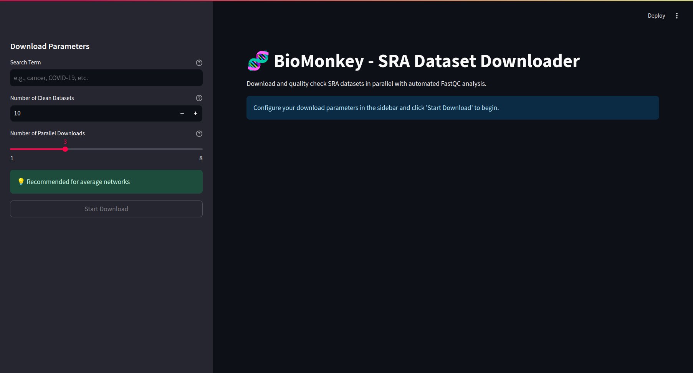

# 🧬 BioMonkey



BioMonkey is a simple script for downloading and quality-checking SRA (Sequence Read Archive) datasets in parallel. It features a user-friendly web interface built with Streamlit and automated quality control using FastQC.

## 🌟 Features

- **Parallel Downloads**: Download multiple SRA datasets simultaneously
- **Automated Quality Control**: Integrated FastQC analysis for each dataset
- **Real-time Progress Tracking**: Visual feedback on download and analysis progress
- **Clean Dataset Management**: Automatic organization of quality-checked datasets
- **User-friendly Interface**: Simple web interface for easy interaction

## 🚀 Getting Started

### Prerequisites

- Python 3.8+
- FastQC
- NCBI Account (for API access)

### Installation

1. Clone the repository:

```bash
git clone https://github.com/KTS-o7/BioMonkey.git
cd BioMonkey
```

2. Install dependencies:

```bash
pip install -r requirements.txt
```

3. Download and install FastQC from [Babraham Bioinformatics](https://www.bioinformatics.babraham.ac.uk/projects/fastqc/)

4. Create a `.env` file in the project root with your NCBI credentials:

```bash
NCBI_API_KEY=your_api_key
NCBI_EMAIL=your_email
FASTQC_PATH=/path/to/fastqc
```

### Usage

1. Start the web interface:

```bash
streamlit run app.py
```

2. In the web interface:

   - Enter your search term (e.g., "cancer", "COVID-19")
   - Specify the number of clean datasets needed
   - Click "Start Download"

3. Monitor progress through the interface:
   - Real-time status updates
   - Download progress
   - Quality check results
   - Success rate metrics

## 📊 How It Works

1. **Search**: Queries NCBI's SRA database using the provided search term
2. **Download**: Downloads datasets in parallel using multiple threads
3. **Quality Control**: Runs FastQC analysis on each downloaded dataset
4. **Filtering**: Moves only high-quality datasets to the clean dataset folder
5. **Cleanup**: Automatically removes temporary files after processing

## 🗂️ Project Structure

- `app.py`: Streamlit web interface
- `sra_downloader.py`: Core downloading and processing logic
- `clean_datasets/`: Storage for quality-checked datasets
- `temp_gz_files/`: Temporary storage for downloads
- `fastqc_temp/`: Temporary storage for FastQC analysis

## ⚙️ Configuration

The tool can be configured through environment variables:

- `NCBI_API_KEY`: Your NCBI API key
- `NCBI_EMAIL`: Your email for NCBI services
- `FASTQC_PATH`: Path to FastQC executable

## 🤝 Contributing

Contributions are welcome! Please feel free to submit pull requests.

1. Fork the repository
2. Create your feature branch
3. Commit your changes
4. Push to the branch
5. Open a pull request

## 📝 License

This project is licensed under the GNU General Public License v2.0 - see the LICENSE file for details.

## 🙏 Acknowledgments

- NCBI for providing access to the SRA database
- Babraham Bioinformatics for FastQC
- The Streamlit team for their excellent framework

## 📧 Contact

For questions or support, please open an issue on GitHub or contact the maintainers.
